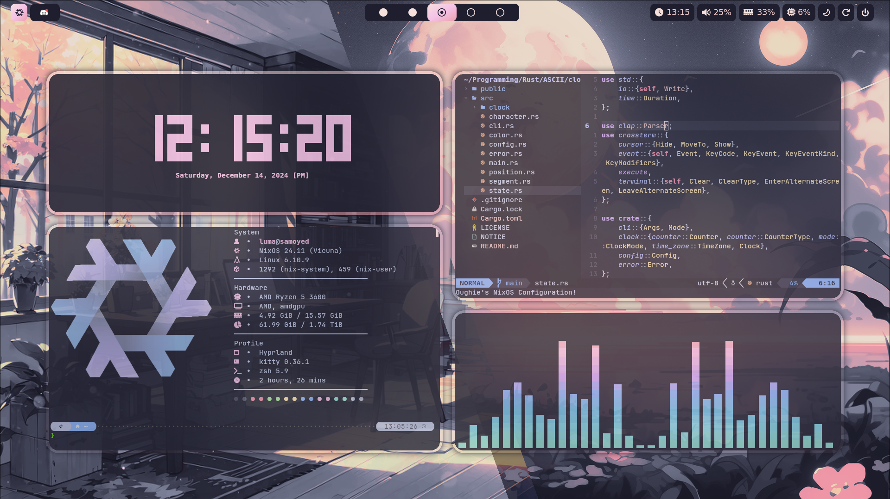

# Oughie's NixOS Configuration :cherry_blossom:

[](https://github.com/Oughie/nixos-config/stargazers)

Personal configuration for Hyprland on NixOS 25.05 :snowflake:



---

## Table of Contents

- [Setup](#setup)
- [Installation](#installation)
- [Keybindings](#keybindings)
  - [Applications](#applications)
  - [Windows](#windows)
  - [Workspaces](#workspaces)
- [Credits](#credits)

## Setup

- **Desktop**
  - **Window Manager:** Hyprland
  - **Theme:** Catppuccin Mocha
  - **Application-Launcher:** Rofi
  - **Status Bar:** Waybar
  - **Display Manager:** SDDM
- **Terminal:**
  - **Emulator**: Kitty, JetBrains Mono
  - **Code Editor:** NeoVim
  - **Shell:** Zsh, Powerlevel10k

The list of additionally installed package can be viewed [here](nixos/modules/packages.nix).

> [!WARNING]
> This configuration is intended for personal use.
> The locale, drivers as well as other things may need to be adjusted for personal preferences.

## Installation

To install this configuration, follow these instructions:

1. Clone the repository into the `~/Configuration` directory:

```
$ git clone https://github.com/Oughie/nixos-config.git ~/Configuration
```

> [!CAUTION]
> The `~/Configuration` directory is used throughout the system configuration.  
> Do not change the directory name!

2. Switch to the new `NixOS` configuration:

```
$ sudo nixos-rebuild switch --flake ~/Configuration
```

3. Apply the new `home-manager` configuration:

```
$ home-manager switch --flake ~/Configuration
```

## Keybindings 

The configuration uses the following keyboard shortcuts:

### Applications

| Shortcut                                           | Action              |
| -------------------------------------------------- | ------------------- |
| <kbd>Super</kbd> + <kbd>D</kbd>                    | Launch rofi         |
| <kbd>Super</kbd> + <kbd>Shift</kbd> + <kbd>S</kbd> | Launch snippet tool |
| <kbd>Super</kbd> + <kbd>Shift</kbd> + <kbd>C</kbd> | Launch color picker |

### Windows

| Shortcut                                           | Action                      | Shortcut                                           | Action              |
| -------------------------------------------------- | --------------------------- | -------------------------------------------------- | ------------------- |
| <kbd>Super</kbd> + <kbd>W</kbd>                    | Kill active window          | <kbd>Super</kbd> + <kbd>H</kbd>                    | Focus left window   |
| <kbd>Super</kbd> + <kbd>S</kbd>                    | Toggle window floating mode | <kbd>Super</kbd> + <kbd>L</kbd>                    | Focus right window  |
| <kbd>Super</kbd> + <kbd>F</kbd>                    | Toggle window fullscreen    | <kbd>Super</kbd> + <kbd>K</kbd>                    | Focus window above  |
| <kbd>Super</kbd> + <kbd>P</kbd>                    | Toggle window pseudo mode   | <kbd>Super</kbd> + <kbd>J</kbd>                    | Focus window below  |
| <kbd>Super</kbd> + <kbd>Shift</kbd> + <kbd>H</kbd> | Move window left            | <kbd>Super</kbd> + <kbd>Alt</kbd> + <kbd>H</kbd>   | Resize window left  |
| <kbd>Super</kbd> + <kbd>Shift</kbd> + <kbd>L</kbd> | Move window right           | <kbd>Super</kbd> + <kbd>Alt</kbd> + <kbd>L</kbd>   | Resize window right |
| <kbd>Super</kbd> + <kbd>Shift</kbd> + <kbd>K</kbd> | Move window up              | <kbd>Super</kbd> + <kbd>Alt</kbd> + <kbd>K</kbd>   | Resize window up    |
| <kbd>Super</kbd> + <kbd>Shift</kbd> + <kbd>J</kbd> | Move window down            | <kbd>Super</kbd> + <kbd>Alt</kbd> + <kbd>J</kbd>   | Resize window down  |

While holding <kbd>Super</kbd>, you can also move the window via left-click or resize it via right-click.

### Workspaces 

| Shortcut                                                 | Action                       |
| -------------------------------------------------------- | ---------------------------- |
| <kbd>Super</kbd> + <kbd>1 .. 5</kbd>                    | Switch to nth workspace      |
| <kbd>Super</kbd> + <kbd>Tab</kbd>                        | Switch to previous workspace |
| <kbd>Super</kbd> + <kbd>Shift</kbd> + <kbd>1 .. 5</kbd> | Move window to nth workspace |

## Credits

The wallpapers were taken from another repository that can be found [here](https://github.com/orxngc/walls-catppuccin-mocha). :heart:
